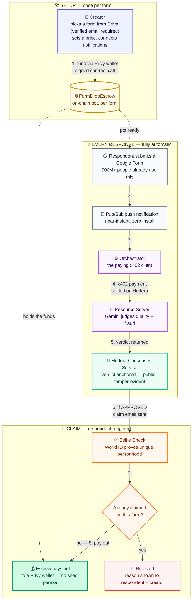

# FormDrop

**Real answers. Instant payouts.**

A Google Forms add-on that pays respondents the instant they submit a valid
response — settled on Hedera, verified by an AI agent and a World ID Selfie
Check, with a Privy-provisioned wallet the respondent never has to set up.
No seed phrase. No wallet UI. No "crypto" anywhere in their experience.

Built for [ETHOnline 2026](https://ethglobal.com/events/ethonline2026).


**Live:** [Creator console](https://formdrop-web.onrender.com) ·
[Orchestrator API](https://formdrop-orchestrator.onrender.com/health) ·
[Resource server API](https://formdrop-resource-server.onrender.com/health) ·
[Escrow contract on Hashscan](https://hashscan.io/testnet/contract/0.0.10515460)

---

## The pitch

Paid surveys have been tried before — as new standalone platforms nobody
adopted, because the hard part was never the payment. It was getting anyone
to show up. FormDrop doesn't ask anyone to show up somewhere new: it ships
inside the tool 700M+ people already use every month.

The two things that made "pay a stranger instantly for a form response"
impossible before now both exist for the first time, together:

- **A trust layer that makes instant payout safe, not a fraud vector.** An
  AI agent judges every response for quality and fraud before anyone gets
  paid, and a one-time World ID Selfie Check makes it worthless to farm the
  pot under a hundred fake emails — one real human, one payout, per form.
- **A settlement layer that makes it economical.** Sub-cent AI verification
  costs, cross-border payouts in seconds, no card-network fees eating a
  $0.10 payout alive. Card rails simply can't do this; Hedera can.

## Customer acquisition is the unfair advantage

Every crypto payments product's hardest problem is the same one: getting
real people to show up and use it. FormDrop doesn't have that problem,
because it isn't asking anyone to adopt anything.

- **Zero new sign-up friction for 700M+ people.** A respondent doesn't
  install an app or create an account — they fill out a Google Form
  exactly like they already do, for a survey, a class assignment, a
  feedback request. The payout is a surprise at the end, not a barrier at
  the start.
- **Zero new distribution cost for creators.** Anyone who already runs
  Google Forms — a professor, a researcher, a community manager, a growth
  team — can turn an existing form into a paid one in minutes. There's no
  new platform to convince anyone to join.
- **The wallet is invisible, so "crypto adoption" doesn't require anyone
  to know they adopted crypto.** That's not a workaround — it's the actual
  distribution strategy: real settlement rails, delivered through a habit
  people already have.

## Value proposition

| Persona | Real-world scenario | Quantifiable impact |
| :--- | :--- | :--- |
| **🎓 The Researcher** | Needs 300 genuine responses to a survey and is tired of manually filtering bot spam and copy-pasted answers. | Sets a price once, funds the pot, and walks away. The AI agent auto-rejects gibberish, near-duplicates, and suspiciously-fast completions — no manual review of a single response. |
| **🌍 The Cross-Border Respondent** | Answers a form from a country where PayPal/Stripe payouts are slow, restricted, or unavailable. | Gets paid in testnet HBAR/USDC in seconds, with a wallet provisioned silently by email — money reaches them through a rail that card networks structurally can't offer at this cost or speed. |
| **🧑‍💻 The Crypto-Naive Respondent** | Has never touched a wallet, doesn't know what a seed phrase is, and never wants to. | Fills a form, clicks a claim link, does a 10-second Selfie Check, and money appears. Privy provisions the wallet behind the scenes — zero new concepts to learn. |
| **🏢 The Growth / Ops Team** | Runs incentivized research at scale and needs to guarantee one payout per real human, not per email address. | World ID's uniqueness proof makes pot-draining via fake-email farming worthless — a nullifier per form means one verified human claims once, enforced by a real database constraint, not just app logic. |
| **🔍 The Auditor (or Judge)** | Wants to verify every claim in this README is real, not staged. | Every payment, payout, and AI verdict is independently checkable on Hedera's public Mirror Node — no API key, no account, no trust required. See "Sponsor integrations" below for the exact transaction ids. |

## Architecture

One respondent journey, entirely on Hedera settlement rails, now with an
on-chain escrow contract enforcing the payout rules instead of just our
own backend promising them:



The **orchestrator** and **resource server** are deliberately two separate
services, not one — the orchestrator is the paying x402 client, the
resource server is the gated service being paid for. That split is the
literal shape of Hedera's AI & Agentic Payments track, not an
architectural nicety.

## Sponsor integrations

| Sponsor | What we built | Proof |
| :--- | :--- | :--- |
| **Hedera** | A live x402-gated verification endpoint, settled in testnet USDC (an HTS token) via the Blocky402 facilitator — real pay-per-call metering, not a flat fee. Every AI verdict is anchored to HCS as a public, tamper-evident audit trail. A Solidity escrow contract on Hedera's Smart Contract Service now holds every form's pot and enforces "never pay the same response twice, never pay out more than was funded" on-chain — a real code-level guarantee, not just an application-level check. | [Payment tx](https://testnet.mirrornode.hedera.com/api/v1/transactions/0.0.7162784-1789139948-706832928) · [HCS topic](https://testnet.mirrornode.hedera.com/api/v1/topics/0.0.10460886) · [Escrow contract](https://hashscan.io/testnet/contract/0.0.10515460) |
| **Privy** | Two Privy wallets, two different Privy controls: a **policy**-gated, receive-only respondent payout wallet, and a creator-side pot-funding wallet owned by a **key quorum** — a real treasury operation for the growth/ops teams running incentivized research at scale (the 🏢 persona above), not a consumer toy. The funding transfer itself is a live financial flow: signed through Privy's `secp256k1_sign` RPC and executed as a real Hedera transaction, not just custodied. | [Privy-signed funding tx](https://testnet.mirrornode.hedera.com/api/v1/transactions/0.0.10439799-1789137988-901478637) |
| **World** | Gates every claim behind a Selfie Check proof of unique personhood, scoped per form — makes pot-draining via fake-email farming worthless, enforced by a real database constraint. | Verified live on a physical device — see [`specs/DECISIONS.md`](specs/DECISIONS.md) for the full trace |

## Setup

Requires Node.js 20+ and pnpm.

```
pnpm install
```

Full step-by-step instructions to run all three services locally and
replicate every integration — Hedera, Gemini, Privy, World ID, Postgres,
Google Forms/Pub/Sub, the escrow contract, all of it — are in
[`SETUP.md`](SETUP.md). Every claim in this README is backed by a real,
independently-checkable transaction or API call — proof links are in
**Sponsor integrations** above; the full planning log, every empirical
finding, and the AI-assisted-development disclosure this event requires
all live in [`specs/DECISIONS.md`](specs/DECISIONS.md). Full project
description: [`specs/PROJECT.md`](specs/PROJECT.md).

All three services deploy together from one [`render.yaml`](render.yaml)
blueprint on [render.com](https://render.com) (New → Blueprint) — public
identifiers are inlined in the committed file, every real secret is
`sync: false` so Render prompts for it instead of it ever living in git.

## Roadmap

- **Google OAuth app verification.** The Forms push-notification path
  requests two sensitive scopes (`forms.responses.readonly`,
  `forms.body.readonly`), so every connecting creator currently clicks
  through Google's "this app isn't verified" warning. Going through
  Google's verification process removes that screen entirely — the real
  prerequisite for onboarding creators beyond a hackathon demo, and more
  load-bearing than a Marketplace listing on its own.
- **Google Workspace Marketplace listing** — once verified, the same
  connect-once, zero-install flow (connect a Google account, click "Enable
  notifications" per form, no script editor) could be surfaced directly
  from a form's own Extensions menu instead of the separate creator
  console.
- **Mainnet.**
- **More settlement assets** as Hedera's stablecoin ecosystem grows
  beyond testnet USDC.

## License

TBD.
