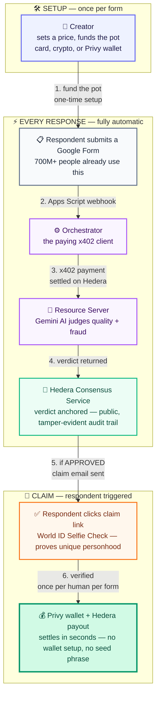

# FormDrop

**Real answers. Instant payouts.**

A Google Forms add-on that pays respondents the instant they submit a valid
response — settled on Hedera, verified by an AI agent and a World ID Selfie
Check, with a Privy-provisioned wallet the respondent never has to set up.
No seed phrase. No wallet UI. No "crypto" anywhere in their experience.

Built for [ETHOnline 2026](https://ethglobal.com/events/ethonline2026).


**Live:** [Creator console](https://formdrop-web.onrender.com) ·
[Orchestrator API](https://formdrop-orchestrator.onrender.com/health) ·
[Resource server API](https://formdrop-resource-server.onrender.com/health)

---

## The pitch

Paid surveys have been tried before — as new standalone platforms nobody
adopted, because the hard part was never the payment. It was getting anyone
to show up. FormDrop doesn't ask anyone to show up somewhere new: it ships
inside the tool 700M+ people already use every month.

The two things that made "pay a stranger instantly for a form response"
impossible before now both exist for the first time, together:

- **A trust layer that makes instant payout safe, not a fraud vector.** An
  AI agent judges every response for quality and fraud before anyone gets
  paid, and a one-time World ID Selfie Check makes it worthless to farm the
  pot under a hundred fake emails — one real human, one payout, per form.
- **A settlement layer that makes it economical.** Sub-cent AI verification
  costs, cross-border payouts in seconds, no card-network fees eating a
  $0.10 payout alive. Card rails simply can't do this; Hedera can.

## Customer acquisition is the unfair advantage

Every crypto payments product's hardest problem is the same one: getting
real people to show up and use it. FormDrop doesn't have that problem,
because it isn't asking anyone to adopt anything.

- **Zero new sign-up friction for 700M+ people.** A respondent doesn't
  install an app or create an account — they fill out a Google Form
  exactly like they already do, for a survey, a class assignment, a
  feedback request. The payout is a surprise at the end, not a barrier at
  the start.
- **Zero new distribution cost for creators.** Anyone who already runs
  Google Forms — a professor, a researcher, a community manager, a growth
  team — can turn an existing form into a paid one in minutes. There's no
  new platform to convince anyone to join.
- **The wallet is invisible, so "crypto adoption" doesn't require anyone
  to know they adopted crypto.** That's not a workaround — it's the actual
  distribution strategy: real settlement rails, delivered through a habit
  people already have.

## Value proposition

| Persona | Real-world scenario | Quantifiable impact |
| :--- | :--- | :--- |
| **🎓 The Researcher** | Needs 300 genuine responses to a survey and is tired of manually filtering bot spam and copy-pasted answers. | Sets a price once, funds the pot, and walks away. The AI agent auto-rejects gibberish, near-duplicates, and suspiciously-fast completions — no manual review of a single response. |
| **🌍 The Cross-Border Respondent** | Answers a form from a country where PayPal/Stripe payouts are slow, restricted, or unavailable. | Gets paid in testnet HBAR/USDC in seconds, with a wallet provisioned silently by email — money reaches them through a rail that card networks structurally can't offer at this cost or speed. |
| **🧑‍💻 The Crypto-Naive Respondent** | Has never touched a wallet, doesn't know what a seed phrase is, and never wants to. | Fills a form, clicks a claim link, does a 10-second Selfie Check, and money appears. Privy provisions the wallet behind the scenes — zero new concepts to learn. |
| **🏢 The Growth / Ops Team** | Runs incentivized research at scale and needs to guarantee one payout per real human, not per email address. | World ID's uniqueness proof makes pot-draining via fake-email farming worthless — a nullifier per form means one verified human claims once, enforced by a real database constraint, not just app logic. |
| **🔍 The Auditor (or Judge)** | Wants to verify every claim in this README is real, not staged. | Every payment, payout, and AI verdict is independently checkable on Hedera's public Mirror Node — no API key, no account, no trust required. See "Setup & proof" below for the exact transaction ids. |

## Architecture

One respondent journey, six steps, entirely on Hedera settlement rails:



The **orchestrator** and **resource server** are deliberately two separate
services, not one — the orchestrator is the paying x402 client, the
resource server is the gated service being paid for. That split is the
literal shape of Hedera's AI & Agentic Payments track, not an
architectural nicety.

## Repo layout

```
apps/
  web/            Next.js — creator console + respondent claim page (Selfie Check -> payout)
  apps-script/    Standalone Google Apps Script — watches any number of forms
services/
  resource-server/  Fastify — x402-gated verification service (the "service" being sold)
  orchestrator/     Fastify — webhook receiver, paying x402 client, HCS anchoring, payouts, email
                    src/db/  Postgres schema + client (forms, responses, used_nullifiers)
packages/
  shared/         Shared TypeScript types/utilities
specs/            Planning docs and AI-assisted-workflow disclosure artifacts
```

## Sponsor integrations

| Sponsor | What we built | Proof |
| :--- | :--- | :--- |
| **Hedera** | A live x402-gated verification endpoint, settled in testnet USDC (an HTS token) via the Blocky402 facilitator — real pay-per-call metering, not a flat fee. Every AI verdict is anchored to HCS as a public, tamper-evident audit trail. | [Payment tx](https://testnet.mirrornode.hedera.com/api/v1/transactions/0.0.7162784-1789139948-706832928) · [HCS topic](https://testnet.mirrornode.hedera.com/api/v1/topics/0.0.10460886) |
| **Privy** | Two Privy wallets, two different Privy controls: a **policy**-gated, receive-only respondent payout wallet, and a creator-side pot-funding wallet owned by a **key quorum** — a real treasury operation for the growth/ops teams running incentivized research at scale (the 🏢 persona above), not a consumer toy. The funding transfer itself is a live financial flow: signed through Privy's `secp256k1_sign` RPC and executed as a real Hedera transaction, not just custodied. | [Privy-signed funding tx](https://testnet.mirrornode.hedera.com/api/v1/transactions/0.0.10439799-1789137988-901478637) |
| **World** | Gates every claim behind a Selfie Check proof of unique personhood, scoped per form — makes pot-draining via fake-email farming worthless, enforced by a real database constraint. | Verified live on a physical device — see "Setup & proof" below |

## Setup & proof

Every integration below was proven with a real, independently-checkable
transaction or API call — not just wired up and assumed to work. Full
planning log and the AI-assisted-development disclosure this event
requires: [`specs/DECISIONS.md`](specs/DECISIONS.md). Full project
description: [`specs/PROJECT.md`](specs/PROJECT.md).

Requires Node.js 20+ and pnpm.

```
pnpm install
```

### Hedera testnet + Blocky402 (resource-server and orchestrator)

1. Create a testnet account at [portal.hedera.com](https://portal.hedera.com)
   (free, instant, includes test HBAR). Grab the **ECDSA** private key, not
   ED25519 — `@x402/hedera` requires `PrivateKey.fromStringECDSA`.
2. `cp services/resource-server/.env.example services/resource-server/.env`
   — set `HEDERA_PAY_TO_ACCOUNT_ID` to the account that should *receive*
   verification payments (public account ID only, no key needed here).
3. `cp services/orchestrator/.env.example services/orchestrator/.env` — set
   `HEDERA_ACCOUNT_ID` / `HEDERA_PRIVATE_KEY` to the account that *pays* for
   verification calls.
4. Start the resource server: `pnpm dev:resource-server` (listens on
   `:4001`).
5. Prove one real x402 payment end to end: `pnpm --filter
   @formdrop/orchestrator spike`. Expect: a 402 challenge from the live
   Blocky402 facilitator on `hedera:testnet`, an automatic signed retry, a
   settled transaction, and a real LLM verification verdict.

No Blocky402 API key is required — the facilitator
(`https://api.testnet.blocky402.com`) is open access.

**Settlement asset:** `/verify` is priced in **testnet USDC** by default
(`X402_SETTLEMENT_ASSET=USDC` in `services/resource-server/.env`, $0.01 per
call) — an HTS token, and `@x402/hedera`'s own default settlement asset on
both Hedera networks, not a bolt-on. Switchable back to native HBAR with
one env var (`X402_SETTLEMENT_ASSET=HBAR`) — both paths are fully proven,
nothing was removed. The pay-to account needs a one-time USDC association
before it can receive it: `pnpm --filter @formdrop/orchestrator
hedera:setup-usdc-pay-to-account` generates a fresh account for exactly
this, signs its own association, and discards the private key immediately
— `resource-server` never needs to hold one.

**Proof this works end to end:** transaction
`0.0.7162784-1788964944-181581350` on Hedera testnet — the original x402
payment settled through Blocky402, in HBAR, for one verification call.
Check it yourself on the public Mirror Node:
[api/v1/transactions/0.0.7162784-1788964944-181581350](https://testnet.mirrornode.hedera.com/api/v1/transactions/0.0.7162784-1788964944-181581350).

After switching settlement to USDC, re-proven independently: transaction
`0.0.7162784-1789139948-706832928` — a real `CRYPTOTRANSFER` of 10,000 base
units (6 decimals) of `0.0.429274` (testnet USDC) from the orchestrator's
operator account to the pay-to account, `result: SUCCESS`, driven by a real
webhook submission that also produced a real Gemini `APPROVE` verdict —
not just the payment step in isolation:
[api/v1/transactions/0.0.7162784-1789139948-706832928](https://testnet.mirrornode.hedera.com/api/v1/transactions/0.0.7162784-1789139948-706832928).

### LLM verification (Google Gemini, free tier)

1. Grab a free API key at [aistudio.google.com/apikey](https://aistudio.google.com/apikey)
   — no billing required for the free tier used here.
2. Add `GEMINI_API_KEY` to `services/resource-server/.env`.

`resource-server/src/verify.ts` calls `gemini-3.6-flash` with structured JSON
output (schema derived from the same `zod` verdict shape used everywhere
else) to judge each response: genuine vs. gibberish, duplicate/near-duplicate
against recent prior answers to the same form, obviously-LLM-generated
boilerplate, and suspiciously-fast completion. This is the actual anti-fraud
gate — the orchestrator pays for this judgment via x402 regardless of the
verdict; only `APPROVE` makes the respondent's payout eligible.

**Proof this works end to end:** three distinct cases run through the full
webhook -> x402 -> Gemini pipeline, not just the LLM in isolation:

| Input | Verdict | Why |
|---|---|---|
| `"ok good nice yes fine"`, 1s | `REJECT` | `isGibberish` + `isSuspiciouslyFast`, confidence 0.98 |
| A specific, realistic answer, 88s | `APPROVE` | confidence 0.98, reasoning cites the concrete detail given |
| Two-word edit of a prior answer | `REJECT` | `isDuplicateOrNearDuplicate`, reasoning names the exact overlap |

Each settled a real, separate Hedera testnet transaction
(`0.0.7162784@1789002671.381366556`, `0.0.7162784@1789002697.084483608`) —
check either on the Mirror Node, e.g.
[api/v1/transactions/0.0.7162784-1789002671-381366556](https://testnet.mirrornode.hedera.com/api/v1/transactions/0.0.7162784-1789002671-381366556).

### Claim email (Gmail SMTP)

1. Enable 2-Step Verification on the sending Gmail account, then generate
   an App Password at [myaccount.google.com/apppasswords](https://myaccount.google.com/apppasswords).
2. Add `GMAIL_USER` and `GMAIL_APP_PASSWORD` to
   `services/orchestrator/.env`. Optionally set `WEB_APP_URL` (defaults to
   `http://localhost:3000`).

The moment `handleFormSubmit` records an `APPROVE` verdict, it fires an
email (`services/orchestrator/src/email.ts`, via `nodemailer`) containing
the respondent's claim link — fire-and-forget, so a slow or bounced email
can never turn a successful paid verification into a webhook failure.

Originally built on Resend; switched after a real Google Form test showed
Resend's test-mode sender only delivers to the Resend account's own
email, not arbitrary respondents — see `specs/DECISIONS.md`
(2026-09-11) for how that was caught and fixed.

**Proof this works end to end:** a real Google Form submission — not a
simulated `curl` — drove a real webhook call, a real x402 payment on
Hedera testnet, a real Gemini `APPROVE`, and a real email delivered to a
third-party inbox (not the sending account's own) with a working claim
link.

### HCS audit trail (verification verdicts, verifiable on-chain)

1. Run once: `pnpm --filter @formdrop/orchestrator hcs:setup-topic` —
   creates the public HCS topic and prints a `HCS_AUDIT_TOPIC_ID` to add to
   `services/orchestrator/.env`.

Every verification call anchors a message to this topic: `formId`,
`responseId`, a SHA-256 hash of the response payload (not the raw payload —
keeps respondent PII off a public ledger), the full verdict, and the x402
transaction id that paid for the judgment. The topic has no admin/submit
key — anyone, including a judge, can query it directly on the Mirror Node
with no keys of ours required.

**Proof this works end to end:** topic
[`0.0.10460886`](https://testnet.mirrornode.hedera.com/api/v1/topics/0.0.10460886),
message 1 — fetched straight from the Mirror Node and base64-decoded:
[api/v1/topics/0.0.10460886/messages/1](https://testnet.mirrornode.hedera.com/api/v1/topics/0.0.10460886/messages/1).
The decoded content is the exact audit record from a real webhook request,
including the real Gemini reasoning text and the real x402 payment
transaction id.

### Privy (respondent payout wallets)

1. Create an app at [privy.io](https://privy.io) — free tier — and grab the
   App ID and App Secret.
2. Add `PRIVY_APP_ID` / `PRIVY_APP_SECRET` to
   `services/orchestrator/.env`.
3. Run once: `pnpm --filter @formdrop/orchestrator privy:setup-policy` —
   creates the receive-only policy applied to every respondent wallet, and
   prints a `PRIVY_RESPONDENT_POLICY_ID` to add to `.env`.
4. Prove the payout path end to end: `pnpm --filter @formdrop/orchestrator
   privy:spike` — provisions a Privy embedded wallet by email (no wallet UI)
   and pays it real testnet HBAR.

Privy has no native Hedera wallet type, so this uses Hedera's EVM-address
auto-account-creation (HIP-583): a Privy `ethereum`-type wallet's address is
paid directly, and Hedera creates a receive-only "hollow" account for it on
first receipt. See `specs/DECISIONS.md` for the full reasoning.

**Proof this works end to end:** Privy wallet
`0xc24034467b7986d5daf89257911d1965020f422c` was provisioned by email and
paid 0.001 HBAR — Hedera auto-created account `0.0.10441626` for it. Check
it on the Mirror Node:
[api/v1/accounts/0xc24034467b7986d5daf89257911d1965020f422c](https://testnet.mirrornode.hedera.com/api/v1/accounts/0xc24034467b7986d5daf89257911d1965020f422c).

### Creator console (apps/web)

1. `cp apps/web/.env.local.example apps/web/.env.local` — set
   `NEXT_PUBLIC_PRIVY_APP_ID` to the same Privy App ID used above (client-safe;
   never put the App Secret in this app).
2. With resource-server and orchestrator both running, `pnpm
   --filter @formdrop/web dev` (listens on `:3000`).
3. Log in (creates your creator embedded wallet). The console opens on
   **Your forms** — a list of forms you've configured, with a **+ New
   form** tile as the only entry point into setup. Opening an
   already-funded form jumps straight to its live dashboard instead of
   re-showing configure/fund controls for something already settled.
4. For a new form, set a price per response and max responses, then fund
   the pot one of three ways:
   - **Pay with card** — real Stripe Checkout (test mode), no crypto
     knowledge required. On successful payment, a webhook marks the form
     funded; the treasury (still the orchestrator's own Hedera operator
     account) is what actually pays respondents out in testnet HBAR. See
     the Stripe setup section below.
   - **Send crypto yourself** — for anyone who already holds crypto:
     native testnet HBAR, or testnet USDC if they'd rather not hold a
     volatile-priced asset. Send it to the shown treasury account and
     paste the transaction id, checked against the Mirror Node, not just
     taken on faith.
   - **Fund from Privy wallet** — a Privy-custodied wallet provisioned per
     form. Send it testnet HBAR, then fund with one click: the transfer out
     of that wallet into the treasury is authorized by a live Privy
     signature, not a key the orchestrator holds. See the Privy-signed
     funding section below.
   The dashboard below polls orchestrator's `/forms/:formId/stats` live.

### Card funding (Stripe, test mode)

1. Grab a free test-mode secret key at
   [dashboard.stripe.com/test/apikeys](https://dashboard.stripe.com/test/apikeys)
   — no billing setup needed. Add `STRIPE_SECRET_KEY` to
   `services/orchestrator/.env`.
2. Register a webhook endpoint for `checkout.session.completed` pointing at
   `<orchestrator-url>/webhooks/stripe`, and add its signing secret as
   `STRIPE_WEBHOOK_SECRET`. While developing locally without a public URL,
   the [Stripe CLI](https://stripe.com/docs/stripe-cli)'s `stripe listen
   --forward-to localhost:4002/webhooks/stripe` prints a usable secret.
3. `USD_CENTS_PER_HBAR` (default 100, i.e. $1/HBAR) is a nominal peg only —
   testnet HBAR has no real value, so this exists purely to give the card
   charge a coherent USD amount.

**Proof this works end to end:** a real Checkout Session was created
against the live Stripe API for a 3-HBAR pot ($3.00 at the default peg),
independently confirmed by re-fetching the session from Stripe's own API
(`amount_total: 300`, correct `formId`/`potTinybar` metadata). The webhook
handler was verified against a properly Stripe-signed test event (via
Stripe's own `generateTestHeaderString` helper, since no public URL exists
yet for a live redirect) — it correctly marked the form funded
(`fundingTransactionId: "stripe:cs_test_..."`) — and a forged signature was
independently confirmed to be rejected (`400 invalid signature`), proving
the check is real, not decorative.

### Stablecoin crypto funding (testnet USDC)

Alongside native HBAR, the "send crypto yourself" path also accepts
testnet USDC (`0.0.429274`) — for creators who'd rather fund with a
stable-priced asset than native HBAR. Requires a one-time association so
the treasury account can receive it: `pnpm --filter @formdrop/orchestrator
hedera:associate-usdc`.

**Proof this works end to end:** the association transaction is real,
independently confirmed on the Mirror Node before (not associated) and
after (associated, 0 balance). The verification logic
(`verifyIncomingTokenTransfer`) was tested against a real, independent
USDC transfer already on testnet — exact match, amount-too-high,
wrong-recipient, and wrong-token-id cases all resolved correctly — and the
live HTTP route (`POST /forms/:formId/verify-funding` with `"asset":
"USDC"`) was exercised the same way, correctly returning a 422 with the
exact computed minimum required.

### Privy-signed pot funding (creator wallet → treasury)

A third funding path where the *fund-the-pot transfer itself* executes
through Privy, not just wallet custody: the orchestrator provisions a Privy
wallet per form (`GET /forms/:formId/privy-wallet`), the creator sends it
testnet HBAR, and `POST /forms/:formId/fund/privy-transfer` builds a real
Hedera `TransferTransaction` moving that HBAR into the treasury, signed via
a bridge (`services/orchestrator/src/hederaPrivySigner.ts`) between Privy's
raw `secp256k1_sign` RPC and Hedera's external-signer `Transaction.signWith`
— both confirmed from the installed SDKs' own source, not assumed.

This wallet is also locked down with a real Privy control: its `owner_id`
is a **key quorum** — a P-256 authorization key our server holds, generated
once via `pnpm --filter @formdrop/orchestrator privy:setup-creator-authorization-key`
(prints `PRIVY_CREATOR_KEY_QUORUM_ID` and
`PRIVY_CREATOR_AUTHORIZATION_PRIVATE_KEY` to add to `.env`). Once set,
Privy itself requires every mutating call against that wallet — including
the raw-sign RPC the funding bridge uses — to carry a signature computed
with that key; holding the app secret alone is no longer enough. (The
simpler Privy *policy* mechanism, used for the respondent wallet above,
can't gate this wallet the same way — `secp256k1_sign` isn't a nameable
policy method in the installed SDK; a key quorum is the right tool here,
not a workaround. See `specs/DECISIONS.md` for the full reasoning.)

**Proof this works end to end:** provisioned a real Privy wallet
(`0xdDB5F014dB67a754A911b52c9C76D862D70b9717`), sent it real testnet HBAR,
then called the funding endpoint — it recovered the wallet's public key via
ECDSA signature recovery (Privy never exposes it directly), signed a real
transfer transaction through Privy with the key-quorum authorization
attached, and got back a real `SUCCESS` receipt
(`0.0.10439799@1789137988.901478637`) on the first attempt. Separately
confirmed the control is real, not decorative: the same RPC call *without*
the authorization signature was rejected by Privy's live API with a `401`.

### World ID (Selfie Check on claim)

1. Create an app at [developer.world.org](https://developer.world.org) —
   grab `app_id`, `rp_id`, and `signing_key` (keep the signing key secret,
   server-side only).
2. Selfie Check needs an extra feature flag enabled by a World rep even for
   sandbox testing — request it through your World point of contact before
   expecting a real claim to succeed.
3. Add `WORLD_APP_ID` / `WORLD_RP_ID` / `WORLD_SIGNING_KEY` to
   `services/orchestrator/.env` (`WORLD_ENVIRONMENT=sandbox` while access is
   pending).
4. The respondent claim page lives at `apps/web`'s `/claim?formId=<id>&responseId=<id>`
   — reachable once a response has been APPROVE'd through the webhook path.

**Proof this works end to end:** done for real, on a physical device.
Sandbox app installed on Android, claim page opened in a browser, QR code
scanned, a real Selfie Check completed — the claim page showed a paid
wallet and transaction id. Independently confirmed on the Mirror Node:
wallet `0xF74850796781F2333D60aE8Ec0CD577c80891576` resolved to Hedera
account `0.0.10442744`, credited 100,000 tinybars via a real
`CRYPTOTRANSFER`:
[api/v1/accounts/0xf74850796781f2333d60ae8ec0cd577c80891576](https://testnet.mirrornode.hedera.com/api/v1/accounts/0xf74850796781f2333d60ae8ec0cd577c80891576).
Re-claiming the same response is correctly rejected (`"already claimed"`).

### Persistence (Postgres via Supabase)

`orchestrator`'s form config, responses/verdicts, and used World ID
nullifiers are stored in real Postgres (`services/orchestrator/src/db/`),
not in-memory — data survives process restarts and redeploys, and the
`used_nullifiers` table's composite primary key (`nullifier`, `action`) is
a real database constraint enforcing "one payout per human per form," not
just an application-level check. Forms are also scoped to their creator
(`creator_id`, set once at creation, never reassignable via re-save), so
the console's **Your forms** list only ever shows forms you actually
created.

1. Create a free project at [supabase.com](https://supabase.com).
2. Grab the connection string from **Project Settings → Database →
   Connection pooling** (Supavisor), not the direct connection string —
   Supabase's direct hostname resolves IPv6-only, which many hosts can't
   reach. The pooler string is IPv4-reachable and works everywhere.
3. Set `DATABASE_URL` in `services/orchestrator/.env` to that string.
4. Apply the schema: `pnpm --filter @formdrop/orchestrator db:migrate`
   (idempotent — safe to re-run).

**Proof this works end to end:** created a form via `POST /forms`,
force-killed the orchestrator process (`kill -9`, not a `tsx watch`
auto-restart), started a fresh process, and queried `GET
/forms/:formId/stats` — the form was still there.

### Deployment (Render)

All three services deploy from one [`render.yaml`](render.yaml) blueprint —
connect this repo at [render.com](https://render.com) (New → Blueprint) and
it provisions `resource-server`, `orchestrator`, and `web` together. Public
identifiers are already inlined in the committed file; every real secret is
marked `sync: false` so Render prompts for it in the dashboard instead of it
ever living in git.

**Proof this works end to end:** each service's exact `buildCommand` and
`startCommand` was run locally against the real monorepo before trusting it
on Render — confirmed `pnpm --filter <pkg>... build` correctly builds
`@formdrop/shared` first for all three, then ran each built `dist/`
output directly and got a real HTTP response back. All three are live at
the links at the top of this README.

## License

TBD.
